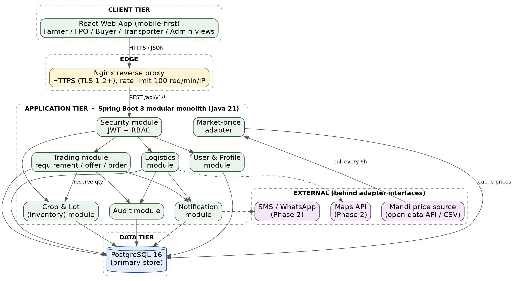

# FarmBridge: Agribusiness Solution

Lightweight workflow connecting farmers/FPOs to buyers: produce lots, offers, orders and logistics in one system.

Deliverables for the Junior Software Developer: Agribusiness Solution internship.

| Week | Deliverable | Status |
|------|-------------|--------|
| 1 | Requirements analysis and planning | Done |
| 2 | Software architecture design and documentation | Done |
| 3+ | Implementation | Not started |

> This repository currently contains **design and documentation only**. No application code has been written yet.

## Problem

Farm records, market prices, buyer needs and logistics live in separate places (paper, WhatsApp, calls). Farmers lose time and margin finding buyers and arranging transport.

## MVP workflow

Farmer/FPO → Produce Lot → Buyer Requirement → Offer → Order → Logistics → Delivery → Completion

## Worked example (illustrative data)

| Step | Actor | Data |
|------|-------|------|
| 1. Produce Lot | Farmer | Tomato, 500 kg, Grade A, harvest ready 3 Oct, Amravati |
| 2. Buyer Requirement | Wholesaler | Tomato, 400 kg, Grade A, delivery by 6 Oct, Nagpur |
| 3. Offer | Farmer | 400 kg at ₹18/kg, valid 24h |
| 4. Order | Wholesaler | Accepts offer, Order #1001 = ₹7,200; lot stock 500 kg → 100 kg |
| 5. Logistics | Transporter | Pickup 5 Oct, drop 6 Oct |
| 6. Completion | System | Delivery confirmed, order completed |

## Week 2: Architecture

FarmBridge is designed as a **modular monolith**: one Spring Boot application with strict module boundaries and one PostgreSQL database. This fits the pilot sizing (about 460 users, about 10 requests/s at the stress point) and keeps the "accept offer" step a single database transaction.

More diagrams:

- [Component interaction](docs/diagrams/02-component-interaction.png)
- [Data flow (Order #1001)](docs/diagrams/03-data-flow.png)
- [Entity-relationship model](docs/diagrams/04-entity-relationship.png)
- [Order state machine](docs/diagrams/05-order-state-machine.png)

Diagram sources (Graphviz) are in [`docs/diagrams/source`](docs/diagrams/source).

## Proposed stack

- Backend: Java 21 + Spring Boot 3
- Database: PostgreSQL 16
- Frontend: React (mobile-first)
- API: REST/JSON, JWT authentication with role-based access
- Deployment: Docker Compose (Nginx, app, database); cloud in a later week

## Docs

**Week 2 (architecture)**

- [Week 2 report: Software Architecture Design and Documentation](docs/Week_2_Architecture_Design.docx)
- [Architecture summary](docs/architecture.md)

**Week 1 (requirements)**

- [Week 1 report: Requirements Analysis and Planning](docs/Week_1_Agribusiness_Requirements_Analysis.docx)
- [Requirements](docs/requirements.md)
- [Roadmap](docs/roadmap.md)
- [Risk register](docs/risk-register.md)

## Scope decision

Complements existing agri infrastructure. Does not recreate e-NAM or government registries.
